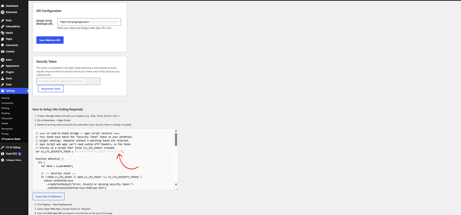
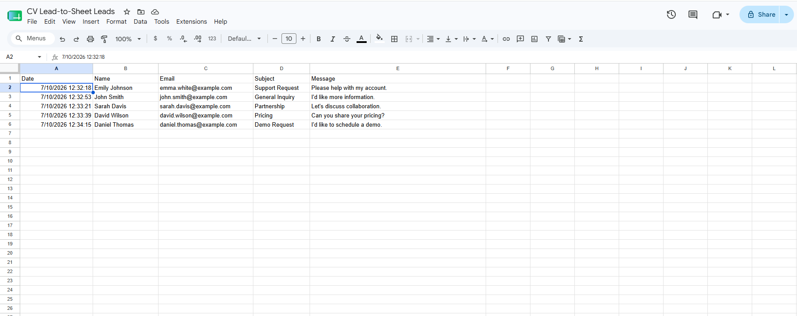
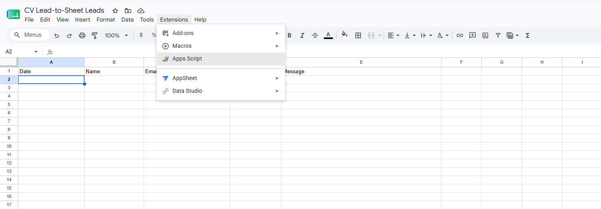
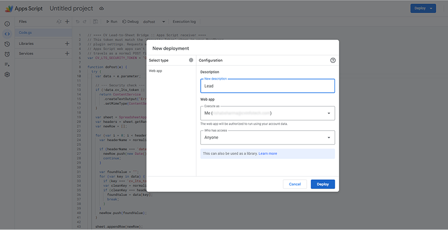
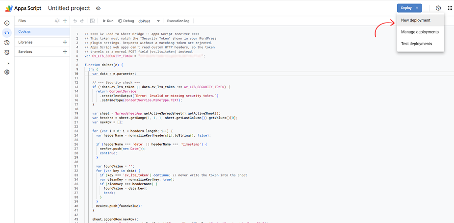
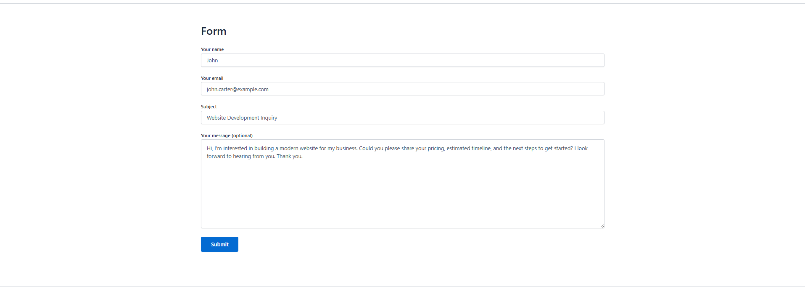

<p align="center">
  
</p>

<h1 align="center">CV Lead-to-Sheet Bridge</h1>

<p align="center">
  Send WordPress form leads straight into Google Sheets in real time — no Zapier, no manual field mapping, no monthly automation bill.
</p>

<p align="center">
  
  
  
  
</p>

---

**CV Lead-to-Sheet Bridge** is a lightweight WordPress plugin that hooks into your form plugin's submission event and pushes each entry to a Google Sheet via a webhook, using a token-secured Google Apps Script as the receiving endpoint.

## Features

- **No Zapier required.** The webhook target is a free Google Apps Script Web App you deploy yourself — no third-party automation subscription, no per-task limits, no external service holding your lead data.
- **Zero-mapping field detection ("Smart-Match").** You don't configure which form field goes in which column. Name your Google Sheet headers whatever you like (`Name`, `Email`, `Phone`...) and the receiving script normalizes and matches incoming field keys to headers automatically — case, spacing, and punctuation are ignored, and CF7's `your-*` field-naming convention is handled on both sides of the match.
- **Security-hardened webhooks.** Every request carries a per-site secret token, generated on activation and rotatable from the settings screen. Apps Script Web Apps can't read custom HTTP headers, so the token is authenticated as a POST body field the receiver validates before writing a single row — anyone who discovers your Web App URL still can't write to your sheet without it.
- **Four form plugins, one integration.** Contact Form 7, WPForms (Lite & Pro), Gravity Forms, and Elementor Pro Forms are all supported out of the box, each normalized to the same `label => value` shape before it's sent.
- **Fire-and-forget delivery.** Webhook calls are non-blocking, so a slow or unreachable Sheet never delays the visitor's form submission.

## How It Works

```
WordPress Form Submission
        │
        ▼
 Form-plugin hook (CF7 / WPForms / Gravity Forms / Elementor)
        │  normalizes fields to { label: value }
        ▼
 cv_lts_send_to_webhook()
        │  appends security token, POSTs (non-blocking)
        ▼
 Google Apps Script Web App  (doPost)
        │  validates token → Smart-Match normalizes keys against
        │  Sheet Row 1 headers → appends matched row
        ▼
   Google Sheet
```

## Project Structure

```
cv-lead-to-sheet-bridge/
├── assets/
│   └── logo-mark.png            # Plugin branding, shown on the settings screen
├── includes/
│   ├── admin-settings.php       # Settings page, security token management,
│   │                             #   generated Apps Script code box
│   └── integrations.php         # Form-plugin hooks + webhook dispatcher
├── cv-lead-to-sheet-bridge.php  # Plugin bootstrap / header
├── index.php                    # Directory-listing silence stub
├── readme.txt                   # WordPress.org plugin readme
├── README.md                    # You are here
├── LICENSE                      # GPLv2
└── .gitignore
```

## Screenshots

<table>
  <tr>
    <td align="center" width="50%">
      <br>
      <sub><b>Settings dashboard</b> — webhook URL, security token, and the generated Apps Script code, ready to copy.</sub>
    </td>
    <td align="center" width="50%">
      <br>
      <sub><b>Google Sheets output</b> — real submissions landing in the right columns, Smart-Matched with zero manual mapping.</sub>
    </td>
  </tr>
  <tr>
    <td align="center" width="50%">
      <br>
      <sub><b>Apps Script setup</b> — the generated receiver script, pasted straight into the Sheet's script editor.</sub>
    </td>
    <td align="center" width="50%">
      <br>
      <sub><b>Web app deployment</b> — deploying the script with "Anyone" access, secured by the embedded token.</sub>
    </td>
  </tr>
</table>

## Installation

1. Upload the `cv-lead-to-sheet-bridge` folder to `/wp-content/plugins/`, or install the zip via **Plugins → Add New → Upload Plugin**.
2. Activate the plugin through the **Plugins** menu in WordPress.
3. Go to **Settings → CV Lead-to-Sheet** to complete the Apps Script setup below.

## Technical Setup Guide

### 1. Create the Google Sheet

Create a new Google Sheet and add your column headers in **row 1** — for example: `Date`, `Name`, `Email`, `Subject`, `Message`. Header names, capitalization, and word order don't need to match your form fields exactly; Smart-Match handles that.

### 2. Open Apps Script

In the Sheet, open **Extensions → Apps Script**.

<p align="center">
  
</p>

### 3. Paste the generated script

In WordPress, go to **Settings → CV Lead-to-Sheet**. The plugin generates a ready-to-use script with your unique security token already embedded — copy it with the **Copy Code to Clipboard** button, then paste it into the Apps Script editor (replacing any boilerplate) and save the project (`Ctrl/Cmd+S`).

<p align="center">
  
</p>

### 4. Deploy as a Web App

Click **Deploy → New deployment**.

<p align="center">
  
</p>

Click the gear icon next to "Select type," choose **Web app**, set **Execute as** to *Me*, and **Who has access** to **Anyone** — this only controls who can *reach the URL*, not who can write data, since that's enforced by the security token baked into the script.

<p align="center">
  
</p>

Click **Deploy**, authorize access when prompted (Google's standard first-run consent for scripts you own), then copy the generated **Web app URL**.

### 5. Connect WordPress to the Web App

Paste the Web App URL into the **Google Script Webhook URL** field on the settings screen and click **Save Webhook URL**.

### 6. Test it

Submit a test entry through any supported form —

<p align="center">
  
</p>

— and confirm a new, correctly matched row appears in the Sheet within a few seconds.

<p align="center">
  
</p>

### Rotating the security token

If you ever suspect your Web App URL has leaked, click **Regenerate Token** on the settings screen. This immediately invalidates the old token — you'll need to re-copy the updated script into the Apps Script editor and redeploy (**Deploy → Manage deployments → Edit → New version → Deploy**) for the change to take effect.

## Supported Form Plugins

| Plugin | Hook Used | Field Key Source |
|---|---|---|
| Contact Form 7 | `wpcf7_mail_sent` | Raw field names (e.g. `your-name`) |
| WPForms (Lite & Pro) | `wpforms_process_complete` | Field `name` |
| Gravity Forms | `gform_after_submission` | Field `label` (composite fields like Name/Address are stitched from sub-inputs) |
| Elementor Pro Forms | `elementor_pro/forms/new_record` | Field `title` |

## Frequently Asked Questions

**Does this cost anything beyond WordPress and Google Sheets?**
No. The receiving endpoint is a Google Apps Script Web App, which is free to deploy on any Google account.

**What happens if a form field has no matching sheet header?**
It's simply not written — Smart-Match only fills columns it finds a match for. Add a header for any field you want captured.

**Is the webhook URL alone enough to write to my sheet?**
No. Every request must include the security token generated on your settings screen; requests without a valid token are rejected by the Apps Script before any row is written.

## Publishing a Release

Releases are automated with GitHub Actions (`.github/workflows/release.yml`). Pushing a version tag builds a clean install-ready ZIP, publishes a GitHub Release, and attaches the ZIP as a downloadable asset — no manual ZIP uploads.

**1. Bump the version** in `cv-lead-to-sheet-bridge.php` (the `Version:` header) and `readme.txt` (`Stable tag:`) so both match. This step is what the workflow validates against the tag, so it's mandatory.

**2. Commit and tag:**

```bash
git add .
git commit -m "Release 1.4.0"
git push

git tag v1.4.0
git push origin v1.4.0
```

**3. GitHub Actions takes it from there:**

- Checks out the repo at that tag.
- Confirms the tag (`v1.4.0`) matches both `Version:` in `cv-lead-to-sheet-bridge.php` and `Stable tag:` in `readme.txt`. If either doesn't match, the workflow fails with an error naming the mismatch and no release is created.
- Copies only the files WordPress needs (`assets/`, `includes/`, the main plugin file, `index.php`, `readme.txt`, `uninstall.php`) into a `cv-lead-to-sheet-bridge/` folder, leaving out `.git/`, `.github/`, `README.md`, `LICENSE`, and other dev-only files.
- Zips that folder as `cv-lead-to-sheet-bridge.zip`.
- Creates a GitHub Release titled "CV Lead to Sheet Bridge v1.4.0", with auto-generated release notes from the commits since the last tag, marked as the Latest release.
- Attaches the ZIP to the release. GitHub tracks its download count automatically from that point on.

A tag pushed with a version that doesn't match the plugin files (e.g. tagging `v1.4.1` while the plugin header still says `1.4.0`) is rejected before anything is built or released, so a mismatched release can't accidentally go out.

## License

GPLv2 or later. See [LICENSE](LICENSE) for the full text.

## Support

Maintained by [CV Infotech](https://cvinfotech.com). For custom development or professional WordPress work, [get in touch](https://cvinfotech.com).
